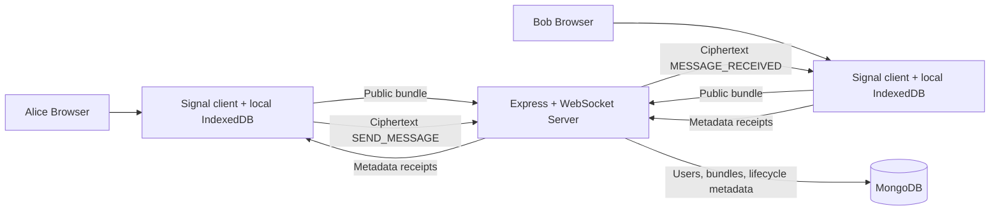

# Secure Chat

## Hackathon Presentation Document

## 1. Project Summary

Secure Chat is a browser-based peer-to-peer messaging application designed to demonstrate real end-to-end encrypted communication using a Signal Protocol-compatible session architecture.

The application combines:

- React and Vite for the browser client
- Express and WebSocket for authenticated real-time transport
- MongoDB and Mongoose for users, public key bundles, and message lifecycle metadata
- JWT and bcrypt for authentication
- `@privacyresearch/libsignal-protocol-typescript@0.0.16` for Signal-style identity keys, prekeys, session establishment, ratcheted encryption, decryption, out-of-order handling, and replay protection

The central security principle is:

> The client handles plaintext and private cryptographic state. The server handles authentication, public key metadata, ciphertext routing, presence, and receipt metadata.

The server must never decrypt messages.

## 2. Problem Statement

Normal chat applications often demonstrate messaging with plaintext or a single shared AES key. That does not demonstrate the important concepts of a modern secure messenger:

- Per-user identity keys
- Signed prekeys
- One-time prekeys
- Session establishment
- Evolving message keys
- Forward-secrecy-oriented ratchet state
- Out-of-order message handling
- Replay rejection
- Ciphertext-only server transport
- Delivery and read metadata

Secure Chat addresses these requirements with a real Signal Protocol-compatible library rather than a homemade cryptographic design.

## 3. Solution

The solution separates responsibilities clearly.

### Client responsibilities

The browser client:

- Generates identity key pairs
- Generates signed prekeys
- Generates one-time prekeys
- Stores private key and session state locally
- Publishes only public key material
- Retrieves a recipient's public bundle
- Establishes a Signal session
- Encrypts plaintext before WebSocket transmission
- Decrypts ciphertext after WebSocket reception
- Displays plaintext only locally
- Sends delivery/read receipts as metadata-only events

### Server responsibilities

The server:

- Registers and authenticates users
- Hashes passwords with bcrypt
- Issues and validates JWTs
- Stores public key bundles
- Relays ciphertext through authenticated WebSockets
- Manages online connections and presence
- Stores message lifecycle metadata
- Routes delivery/read receipts
- Validates receipt authorization
- Queues offline ciphertext in memory

The server does not:

- Receive plaintext
- Decrypt ciphertext
- Receive private keys
- Receive Signal session secrets
- Store plaintext messages

## 4. High-Level Architecture



## 5. Message Flow

### Initial setup

1. Alice registers or logs in.
2. Bob registers or logs in.
3. Each browser creates local Signal key material.
4. Each browser publishes a public key bundle.
5. Alice retrieves Bob's public bundle.
6. Alice establishes a session using the installed Signal implementation.

### Sending a message

```text
Alice types plaintext
        |
        v
Alice client Signal encrypt()
        |
        v
Ciphertext payload
        |
        v
WebSocket SEND_MESSAGE
        |
        v
Server validates metadata and relays ciphertext
        |
        v
Bob receives MESSAGE_RECEIVED
        |
        v
Bob client Signal decrypt()
        |
        v
Bob displays local plaintext
```

The plaintext does not cross the server boundary.

## 6. Signal Implementation

The project uses:

```text
@privacyresearch/libsignal-protocol-typescript@0.0.16
```

This is a maintained TypeScript implementation suitable for the browser build. It is not the official Signal `libsignal` package.

APIs used include:

- `setWebCrypto`
- `KeyHelper.generateIdentityKeyPair`
- `KeyHelper.generateSignedPreKey`
- `KeyHelper.generatePreKey`
- `KeyHelper.generateRegistrationId`
- `SignalProtocolAddress`
- `SessionBuilder.processPreKey`
- `SessionCipher.encrypt`
- `SessionCipher.decryptPreKeyWhisperMessage`
- `SessionCipher.decryptWhisperMessage`

The implementation delegates session and ratchet behavior to the library. The project does not implement AES, a homemade ratchet, or custom Signal cryptography.

## 7. Key Material and Storage

### Public data sent to the server

- Identity public key
- Signed prekey public key
- Signed prekey signature
- One-time prekey public keys
- Registration ID

### Private data kept in the browser

- Identity private key
- Signed prekey private key
- One-time prekey private keys
- Serialized Signal sessions
- Trusted identity records
- Ratchet/session state

Browser Signal state is stored in IndexedDB. Private cryptographic material is not stored in `localStorage` and is never sent through `fetch()` or `WebSocket.send()`.

Local UI metadata such as authentication state, contacts, and locally displayed message state is scoped by authenticated user ID.

## 8. WebSocket Protocol

### Send ciphertext

```json
{
  "type": "SEND_MESSAGE",
  "messageId": "alice-message-id",
  "receiverId": "bob-user-id",
  "ciphertext": {
    "type": 3,
    "body": "base64-encoded-signal-message",
    "registrationId": 123
  }
}
```

### Receive ciphertext

```json
{
  "type": "MESSAGE_RECEIVED",
  "messageId": "alice-message-id",
  "senderId": "alice-user-id",
  "receiverId": "bob-user-id",
  "ciphertext": {
    "type": 3,
    "body": "base64-encoded-signal-message"
  },
  "timestamp": "2026-09-24T00:00:00.000Z"
}
```

### Delivery receipt

```json
{
  "type": "MESSAGE_DELIVERED",
  "messageId": "alice-message-id",
  "senderId": "alice-user-id",
  "receiverId": "bob-user-id",
  "timestamp": "2026-09-24T00:00:01.000Z"
}
```

### Read receipt

```json
{
  "type": "MESSAGE_READ",
  "messageId": "alice-message-id",
  "senderId": "alice-user-id",
  "readerId": "bob-user-id",
  "timestamp": "2026-09-24T00:00:02.000Z"
}
```

Receipts contain metadata only. They never contain plaintext, private keys, ciphertext internals, or session secrets.

## 9. Message Lifecycle

```text
SENT
  |
  v
DELIVERED
  |
  v
READ
```

- `SENT`: ciphertext accepted by the server and message metadata created.
- `DELIVERED`: Bob decrypts locally and sends `MESSAGE_DELIVERED`.
- `READ`: Bob explicitly opens/marks the message as read and sends `MESSAGE_READ`.

The server validates that the authenticated user is the stored message receiver before accepting a receipt.

Duplicate receipts are handled idempotently.

## 10. Directory Structure

```text
secure-chat/
├── client/
│   ├── src/
│   │   ├── components/
│   │   │   ├── EncryptionBadge.jsx
│   │   │   └── OnlineStatus.jsx
│   │   ├── context/
│   │   │   ├── AuthContext.jsx
│   │   │   ├── ChatContext.jsx
│   │   │   └── ThemeContext.jsx
│   │   ├── crypto/
│   │   │   ├── decryption.js
│   │   │   ├── encryption.js
│   │   │   ├── keyManager.js
│   │   │   ├── sessionManager.js
│   │   │   └── signalClient.js
│   │   ├── pages/
│   │   │   ├── Chat.jsx
│   │   │   ├── Login.jsx
│   │   │   └── Register.jsx
│   │   ├── services/
│   │   │   ├── authService.js
│   │   │   └── userService.js
│   │   ├── App.jsx
│   │   ├── main.jsx
│   │   └── styles.css
│   ├── tests/
│   │   ├── phase6-signal.test.mjs
│   │   ├── phase7-websocket-signal.test.mjs
│   │   ├── phase8-receipts.test.mjs
│   │   ├── phase10-security.test.mjs
│   │   └── phase10-final-demo.test.mjs
│   ├── package.json
│   └── vite.config.js
├── server/
│   ├── src/
│   │   ├── config/db.js
│   │   ├── middleware/authMiddleware.js
│   │   ├── models/
│   │   │   ├── KeyBundle.js
│   │   │   ├── MessageMetadata.js
│   │   │   └── User.js
│   │   ├── routes/
│   │   │   ├── authRoutes.js
│   │   │   ├── keyRoutes.js
│   │   │   └── index.js
│   │   ├── websocket/
│   │   │   ├── connectionManager.js
│   │   │   ├── messageRouter.js
│   │   │   ├── receiptHandler.js
│   │   │   └── websocketServer.js
│   │   └── server.js
│   ├── package.json
│   └── .env
├── shared/
├── package.json
├── .gitignore
├── README.md
└── HACKATHON_PRESENTATION.md
```

## 11. Authentication

Registration:

1. Browser sends username and password over HTTPS in deployment.
2. Server hashes the password with bcrypt.
3. Server stores only the password hash.
4. Server returns a JWT and public user identity.

Login:

1. Browser sends credentials over HTTPS.
2. Server compares the password using bcrypt.
3. Server returns a JWT on success.
4. The client uses the JWT for authenticated API and WebSocket access.

Unauthorized WebSocket connections are closed with code `1008`.

## 12. Security Controls

Implemented controls include:

- JWT authentication
- bcrypt password hashing
- Authenticated WebSocket connections
- Public/private key separation
- Client-side Signal encryption/decryption
- IndexedDB private Signal state
- Ciphertext-only server relay
- No plaintext server storage
- Receipt authorization
- Duplicate message ID rejection
- Duplicate receipt idempotency
- Ciphertext size/type/base64 validation
- Message ID validation
- WebSocket maximum payload limit
- Malformed JSON error handling
- Replay rejection delegated to the Signal library
- Out-of-order message support delegated to the Signal library
- React text rendering without `dangerouslySetInnerHTML`
- User-scoped local UI persistence

## 13. Demo Presentation Script

### Opening

> Secure Chat is a browser-based encrypted messaging system. The key design decision is that encryption happens before a message reaches the server. The server routes ciphertext but cannot decrypt it.

### Demonstration

1. Open the deployed frontend.
2. Register Alice.
3. Open a second browser profile.
4. Register Bob.
5. Add the other username from each chat dashboard.
6. Send `Hello Bob` from Alice.
7. Show that Bob receives and displays the message.
8. Point out the encrypted indicator and delivery/read states.
9. Send three messages quickly.
10. Disconnect Bob and send another message from Alice.
11. Reconnect Bob and show offline ciphertext delivery.
12. Explain that the server receives ciphertext and metadata, not plaintext.

### Technical proof points

- The Signal library creates identity keys, signed prekeys, one-time prekeys, and sessions.
- Different messages produce different ciphertext.
- Out-of-order messages decrypt successfully within the library's supported skipped-key behavior.
- Replayed message keys are rejected with `MessageCounterError`.
- Delivery and read receipts contain metadata only.

## 14. Testing Commands

Run from the `client` directory:

```powershell
node tests/phase6-signal.test.mjs
node tests/phase7-websocket-signal.test.mjs
node tests/phase8-receipts.test.mjs
node tests/phase10-security.test.mjs
node tests/phase10-final-demo.test.mjs
npm run build
```

Start the backend:

```powershell
cd server
npm start
```

Start the frontend:

```powershell
cd client
npx vite --host=0.0.0.0
```

## 15. Known Limitations

- The server-side offline ciphertext queue is in memory and is lost if the server restarts.
- Pending receipt forwarding to an offline sender is not persisted.
- Contact lookup currently requires a username.
- Production deployment requires HTTPS/WSS and carefully configured environment variables.
- The browser crypto dependency produces known non-fatal Vite `fs`/`path` externalization warnings.
- The production crypto bundle is larger than Vite's advisory chunk threshold.
- This project does not claim every security property of Signal Messenger.
- Device verification, multi-device identity management, abuse prevention, rate limiting, and a formal security audit remain future production requirements.

## 16. Closing Pitch

Secure Chat demonstrates that a real encrypted messaging architecture requires more than adding AES to a chat form. It combines authenticated transport, public key distribution, Signal-compatible sessions, client-only plaintext, ratcheted message encryption, replay/out-of-order handling, offline ciphertext delivery, and metadata-only receipts in one explainable system.
